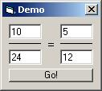



## Simplify Fractions

### Description

This program will simplify your fractions. You input [3 / 9] and it will return [1 / 3]. Please let me know of any bugs/fractions that are not working.
 
### More Info
 

             |
---                |---
**Submitted On**   |2005-03-22 22:50:04
**By**             |[Amine Haddad](https://github.com/Planet-Source-Code/PSCIndex/blob/master/ByAuthor/amine-haddad.md)
**Level**          |Intermediate
**User Rating**    |4.0 (8 globes from 2 users)
**Compatibility**  |VB 3\.0, VB 4\.0 \(16\-bit\), VB 4\.0 \(32\-bit\), VB 5\.0, VB 6\.0
**Category**       |[Math/ Dates](https://github.com/Planet-Source-Code/PSCIndex/blob/master/ByCategory/math-dates__1-37.md)
**World**          |[Visual Basic](https://github.com/Planet-Source-Code/PSCIndex/blob/master/ByWorld/visual-basic.md)
**Archive File**   |[Simplify\_F1866863222005\.zip](https://github.com/Planet-Source-Code/amine-haddad-simplify-fractions__1-59593/archive/master.zip)

